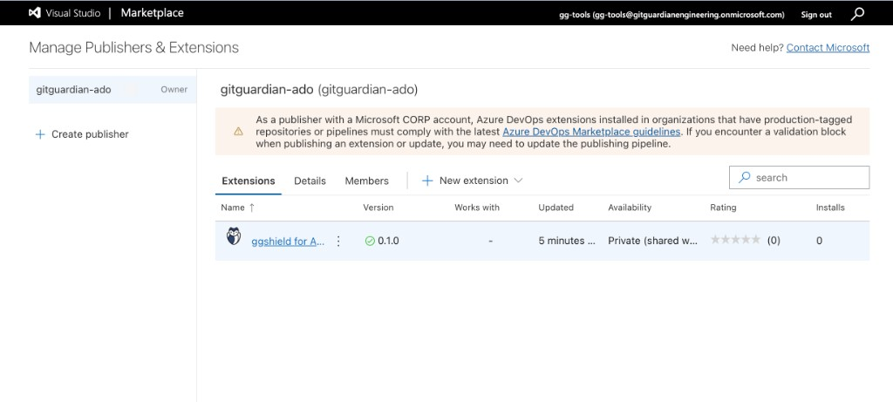
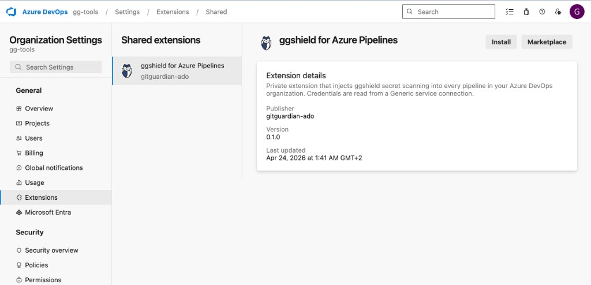
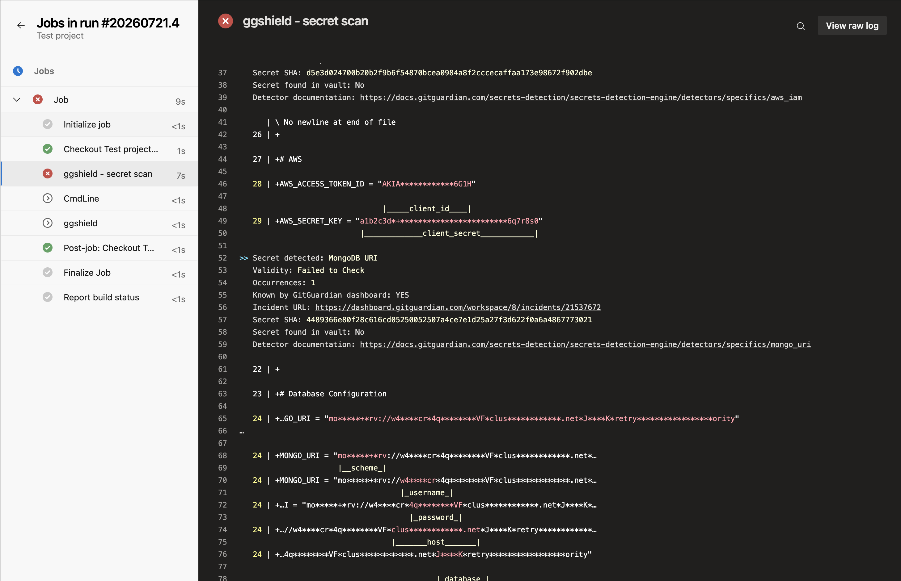

# ggshield for Azure Pipelines (private decorator extension)

Scaffold for an Azure DevOps extension that:

1. Ships a **custom task** (`ggshield@0`) which reads ggshield credentials from a **Generic service connection** (typed `connectedService:Generic` input — the one context where Azure DevOps actually resolves endpoint fields in YAML pipelines).
2. Ships a **pipeline decorator** that auto-injects that task right after the implicit `checkout` step of every agent job in every pipeline in the org.

Share a single ggshield API key across all pipelines in an Azure DevOps organization without asking every repo owner to edit YAML and without using variable groups or Azure Key Vault.

## Prerequisites

- Node.js 18+ and npm
- `tfx-cli`: `npm install -g tfx-cli`
- A publisher account on the Visual Studio Marketplace: https://marketplace.visualstudio.com/manage

## Configure

Before building, edit `vss-extension.json`:

- Replace `REPLACE-WITH-YOUR-PUBLISHER-ID` with your Marketplace publisher ID. **Required** — `tfx` will refuse to package the extension otherwise, and the resulting `.vsix` filename encodes this value.
- Bump the top-level `version` field manually for each release. The build script intentionally does not auto-bump so versions stay deterministic and reviewable.

### Versioning: one number to bump

Azure DevOps tracks **two** versions for this kind of extension:

| Where                                  | What it controls                                                                |
| -------------------------------------- | ------------------------------------------------------------------------------- |
| `vss-extension.json` → `version`       | Marketplace upgrade detection (and `.vsix` filename)                            |
| `ggshield-scan-task/task.json` → `version: { Major, Minor, Patch }` | Whether ADO agents pull new task bits                                           |

Both must agree, or you get either a stale task running on agents (Marketplace updated, agents didn't) or a rejected upload (agents would update, Marketplace says "already at this version"). To avoid keeping them in sync by hand, **only edit `vss-extension.json`'s `version`**: `build.sh` parses it and rewrites the `Major/Minor/Patch` block in `task.json` before packaging. The result is deterministic — commit the resulting `task.json` change alongside the manifest bump.

If you ever need to sync without a full build (e.g. to commit a version bump separately), you can run just the sync step:

```bash
node -e 'const fs=require("fs");const ext=JSON.parse(fs.readFileSync("vss-extension.json","utf8"));const m=/^(\d+)\.(\d+)\.(\d+)$/.exec(ext.version);const[,M,m2,p]=m.map(Number);const t=JSON.parse(fs.readFileSync("ggshield-scan-task/task.json","utf8"));t.version={Major:M,Minor:m2,Patch:p};fs.writeFileSync("ggshield-scan-task/task.json",JSON.stringify(t,null,2)+"\n")'
```

## Build

```bash
./build.sh
```

Output: a `.vsix` file in the project root, named `<publisher>.ggshield-ado-private-extension-<version>.vsix`.

## Publish privately

1. Go to https://marketplace.visualstudio.com/manage.
2. Upload the `.vsix`. Once uploaded, the extension shows up under your publisher with **Availability: Private (shared with…)**:

   
3. On the uploaded extension, click `...` → **Share/Unshare** → add your ADO organization by name (e.g. `https://dev.azure.com/myorg`).
4. In your ADO org: **Organization Settings → Extensions → Shared** → click the extension and **Install**:

   

Private extensions are **not** reviewed by Microsoft. They're available to the target org immediately after sharing.

## Configure a service connection

In the target ADO project:

1. **Project Settings → Service connections → New service connection → Generic**.
2. Fill in:
   - **Server URL**: your GitGuardian **dashboard** URL — `https://dashboard.gitguardian.com` for SaaS US, `https://dashboard.eu1.gitguardian.com` for SaaS EU, or your self-hosted dashboard URL. (ggshield derives the API URL from this; passing the API URL directly will fail to authenticate.) Leave blank to use the SaaS US default.
   - **Username**: leave blank.
   - **Password/Token Key**: your ggshield API key.
   - **Service connection name**: `gitguardian-api` **(must match exactly — the decorator YAML references this name)**.
3. Tick **Grant access permission to all pipelines**.


## Test

1. Create or pick a throwaway repo in the ADO project.
2. Create a minimal `azure-pipelines.yml`:
   ```yaml
   trigger: [main]
   pool:
     vmImage: ubuntu-latest
   steps:
     - script: echo "my real build steps go here"
   ```
3. Run the pipeline. You should see an extra step right after `Checkout`:
   `ggshield - secret scan`
4. To verify the env-var plumbing, add a hardcoded test secret to the repo — the scan should fail the build with a detected-secret report:

   

### Opt-out for a specific pipeline

```yaml
variables:
  skipGGShield: true
```

Useful for the pipeline that builds this extension itself (otherwise you'll get infinite recursion of self-scans).

## Before rolling out org-wide

Because this decorator fires on every agent job in every pipeline in the organization, a broad rollout can meaningfully increase the number of ggshield calls hitting the GitGuardian API. Those calls are subject to **API rate limits** shared across your workspace — review your current quotas and headroom before switching the extension on for the whole org:

- [API usage, quotas, and rate limiting](https://docs.gitguardian.com/api-docs/usage-and-quotas#rate-limiting)

### Built-in safety net

The task has a `scanTimeoutSeconds` input (default: `80`). When the scan exceeds it, ggshield is terminated and the step completes as `SucceededWithIssues` (a warning, not a failure). This exists specifically to contain GitGuardian API rate-limit events: `pygitguardian` retries on `429` indefinitely, so without this cap a transient rate-limit incident would silently turn into an org-wide pipeline outage via ggshield's retry loop. Tune it down (e.g. `30`) on fast pipelines where you'd rather fail-open than wait, or up for large monorepo scans.

## Known limits of this scaffold

- ggshield is auto-installed on demand if not present on the agent. The task tries `pipx`, then `python3 -m pip`, `python -m pip`, `pip3`, and `pip` in that order. For self-hosted agents, bake ggshield into the agent image to remove ~5s of cold-start overhead per job.
- Only `secret scan ci` / `path` / `docker` modes are exposed.
- Windows-hosted agents need Python 3.8+ on PATH for the auto-install to work.
- The decorator fires on every agent job. If you have many short jobs, consider gating by branch or repo path via `${{ if ... }}` in `decorator/ggshield-decorator.yml`.

## Future ideas

- Publish scan results as an artifact / add a custom tab in the run summary.
- Support JSON output → SARIF conversion for the ADO security UI.
