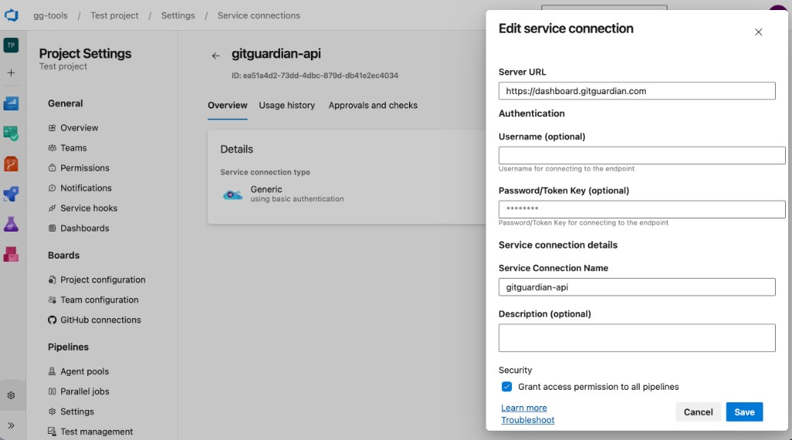

# ggshield for Azure Pipelines

ggshield for Azure DevOps is an Azure DevOps extension that lets you share a single ggshield API key across every pipeline in an organization. The extension contains

- a custom task (`ggshield@0`) that reads credentials from a typed Generic service connection (`connectedService:Generic`)
- a pipeline decorator that auto-injects that task right after the implicit `checkout` step of every agent job

## Configure a service connection

In the target ADO project:

1. Configure a new service connection in your Azure DevOps project settings
2. Set the URL of your GitGuardian instance (default `https://dashboard.gitguardian.com`) as a server URL
3. Set your GitGuardian service account token as a password
4. Set the service connection name to `gitguardian-api``
5. Grant access permission to all pipelines



## Opt-out for a specific pipeline

```yaml
variables:
  skipGGShield: true
```
